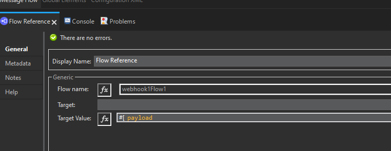
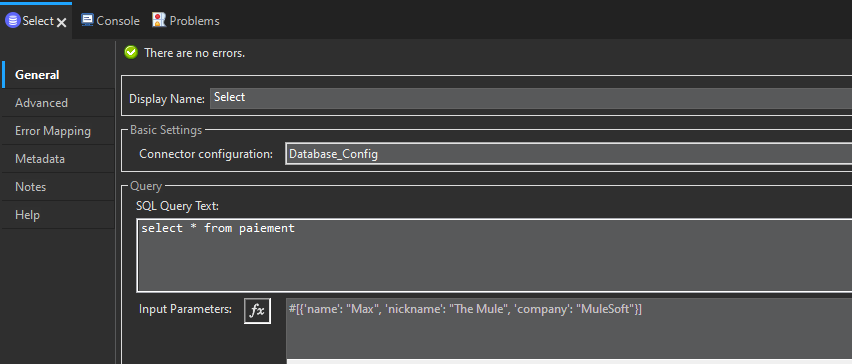
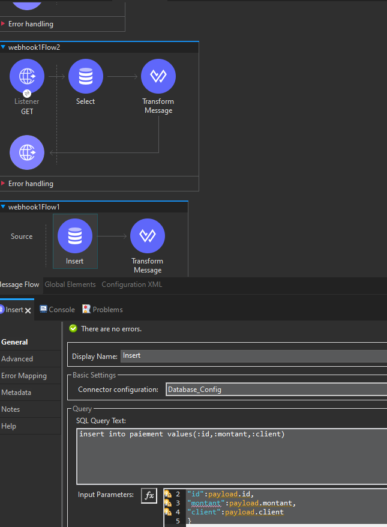

# MuleSoft


## WebHook (POST)





## SFTP
Téléchargez le serveur SFTP de test:
https://www.rebex.net/tiny-sftp-server/#download

## Scatter-Gather

## Scheduler

## Dataweave
```dw
%dw 2.0
output application/java
var a1 = [1, "a", true]
var a2 = {"Chris":2, "Tai":34,"TY":23}
---

{
	adde: a1 ++ a1 ,
	add2 :  a1+a1,
	minus1 : a2 - "Chris",
	minius2 : a2 -- {"Chris":2}
}
```
